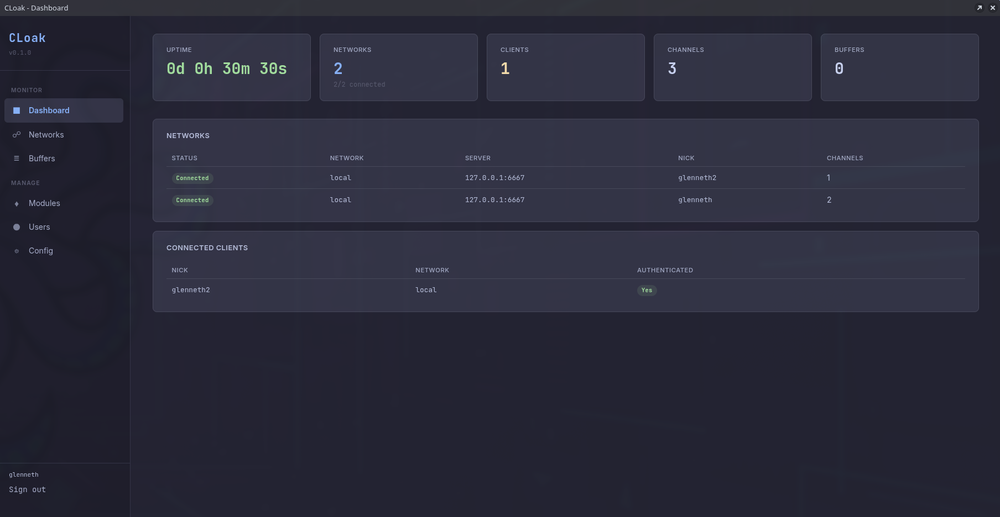
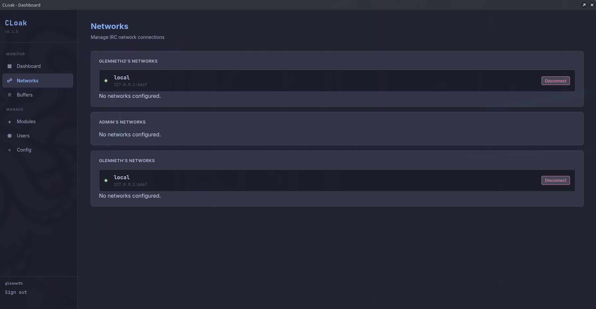
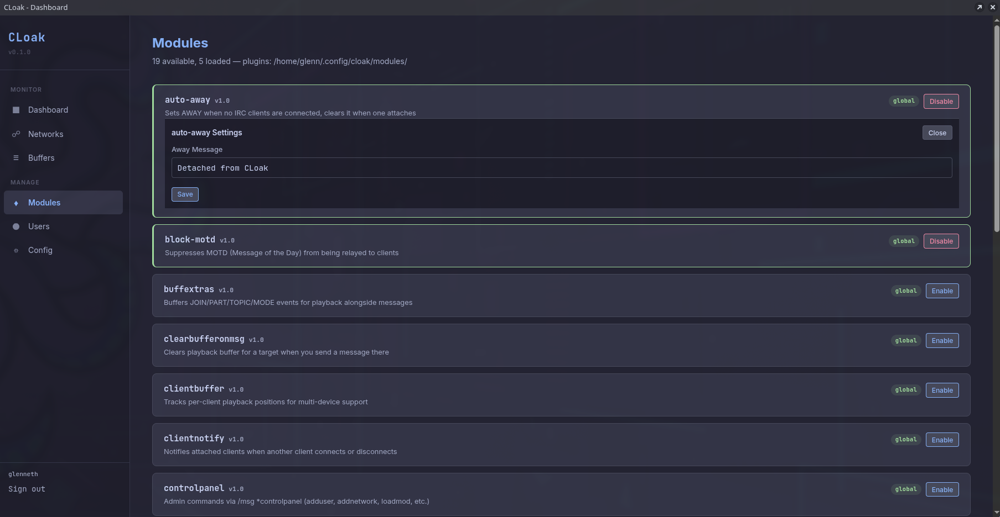
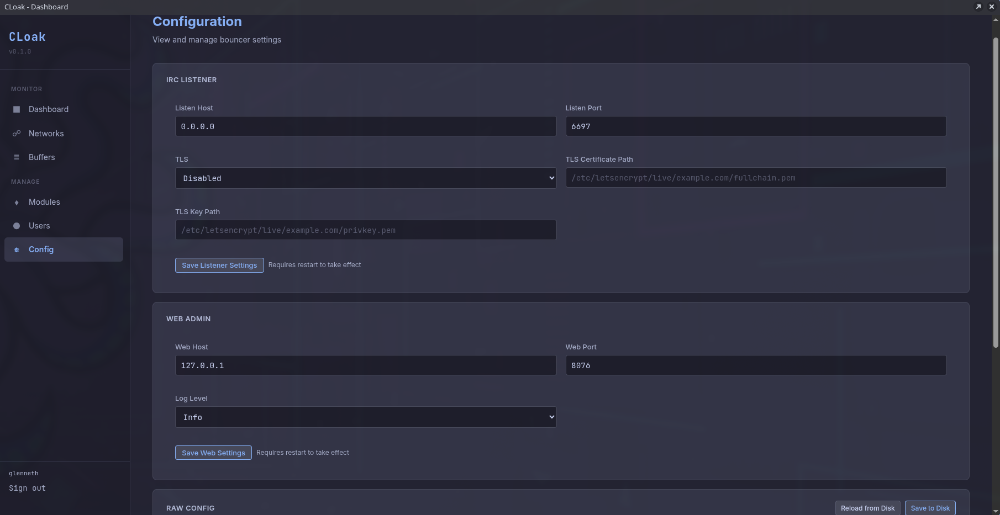

# CLoak

An IRC bouncer written in Common Lisp with a [Fluxion](https://github.com/glenneth1/Fluxion) web admin interface.

## What is CLoak?

CLoak sits between your IRC clients and the IRC server, maintaining a persistent
connection so you stay online 24/7. When your client reconnects, CLoak replays
any messages you missed.

## Features

### Core
- **Persistent connections** - stays connected even when all clients disconnect
- **Message buffering** - ring buffer per channel/DM with configurable size
- **Per-client playback** - each client gets only messages it missed
- **Multi-network** - connect to multiple IRC networks simultaneously
- **Multi-user** - host for yourself or your team
- **TLS** - both upstream (to server) and downstream (to clients)
- **SASL** - relay SASL authentication to upstream servers

### IRCv3
- CAP negotiation (302)
- Message tags passthrough (server-time, msgid, batch)
- CHATHISTORY integration
- Labeled responses

### Web Admin (Fluxion)
- Dashboard with connection status and uptime
- Network management (add/edit/remove)
- User management
- Buffer viewer
- Module management
- Config editor
- Live log viewer

### Modules
- Extensible module system (similar to ZNC)
- Modules can hook into upstream and downstream message flow

### Operations
- Runs as a systemd service
- Lisp config file (human-editable, web-editable)
- Config auto-generated on first run

## Screenshots

### Dashboard

At-a-glance overview showing uptime, connected networks, attached clients, active channels, and buffered messages. Network status and connected clients are listed below.

### Networks

Per-user network management. View connection status, connect/disconnect networks, and add or edit network configurations.

### Modules

ZNC-style module system with enable/disable toggles and inline settings. Modules extend CLoak with features like auto-away, MOTD blocking, playback extras, and per-client buffer tracking.

### Configuration

Edit IRC listener settings (host, port, TLS), web admin binding, and log level directly from the browser. Also provides raw config access for advanced users.

## Dependencies

- SBCL (or CCL)
- Quicklisp
- [Fluxion](https://github.com/glenneth1/Fluxion)

## Quick Start

```lisp
(ql:quickload "cloak")
(cloak:start)
```

Configure your IRC client to connect to CLoak:
- **Server**: localhost (or your server IP)
- **Port**: 6697 (TLS)
- **Password**: `username/network:password`

## Configuration

Config lives at `~/.cloak/config.lisp`. Generated automatically on first run.
Edit it manually or through the web admin at `http://localhost:8076`.

```lisp
(:listen-host "0.0.0.0"
 :listen-port 6697
 :listen-tls t
 :tls-cert "/path/to/cert.pem"
 :tls-key "/path/to/key.pem"
 :web-host "127.0.0.1"
 :web-port 8076
 :users
 ((:name "glenn"
   :password-hash "..."
   :admin-p t
   :networks
   ((:name "libera"
     :server "irc.libera.chat"
     :port 6697
     :tls t
     :nick "glenneth"
     :sasl :plain
     :autojoin ("#lisp" "#emacs" "#commonlisp"))))))
```

## Systemd Service

```bash
sudo cp cloak.service /etc/systemd/system/
sudo systemctl enable --now cloak
```

## File Structure

| File | Description |
|------|-------------|
| `src/package.lisp` | Package definitions |
| `src/config.lisp` | Configuration system (read/write/generate) |
| `src/protocol.lisp` | IRC message parsing/formatting, IRCv3 tags |
| `src/buffer.lisp` | Ring buffer for message storage |
| `src/upstream.lisp` | Bouncer → IRC server connections |
| `src/downstream.lisp` | IRC client → Bouncer connections |
| `src/bouncer.lisp` | Core orchestration and message relay |
| `src/modules.lisp` | Extensible module framework |
| `src/main.lisp` | Entry point and CLI |
| `web/` | Fluxion web admin interface |
| `test/` | FiveAM test suite |

## License

MIT
